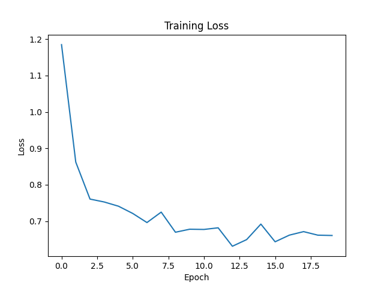
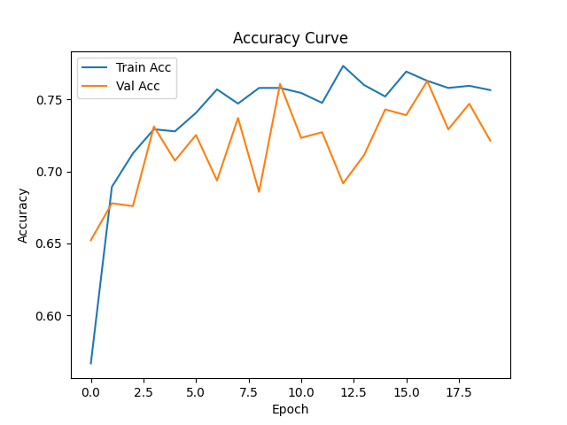

# Garbage Classification Based on MobileNetV2

基于 PyTorch 与 MobileNetV2 的垃圾检测项目，实现了：

- 垃圾图像分类
- GPU 加速训练
- 批量图片推理
- 自动保存预测结果
- 训练日志保存
- Loss / Accuracy 曲线绘制

本项目适用于：

- 人工智能实验课程
- 深度学习课程设计
- 图像分类入门学习
- PyTorch 迁移学习实践

---

## 项目效果

### 支持垃圾分类类别

| 类别 | 中文 |
|------|------|
| cardboard | 纸板 |
| glass | 玻璃 |
| metal | 金属 |
| paper | 纸张 |
| plastic | 塑料 |
| trash | 其他垃圾 |

---

## 项目结构

```text
Garbage_detection/
│
├── train.py                      # 模型训练
├── predict.py                    # 模型推理
├── README.md
│
├── garbage-classification/       # 数据集
│   ├── cardboard/
│   ├── glass/
│   ├── metal/
│   ├── paper/
│   ├── plastic/
│   └── trash/
│
├── inputs/                       # 待预测图片
│
├── results/                      # 推理结果
│
├── train_result/                 # 训练结果
│   ├── train_log.csv
│   ├── loss_curve.png
│   └── acc_curve.png
```

---

## 开发环境

### 软件环境

- Python 3.10
- PyTorch
- torchvision
- matplotlib

### 硬件环境

- GPU：NVIDIA RTX 4060
- CUDA 加速训练

---

## 环境安装

使用 Conda 创建虚拟环境。

### 创建环境

```bash
conda create -n yolo11 python=3.10
```

### 激活环境

```bash
conda activate yolo11
```

### 安装依赖

```bash
pip install torch torchvision matplotlib pillow
```

---

## 数据集准备

数据集链接：https://www.kaggle.com/datasets/asdasdasasdas/garbage-classification?resource=download

将垃圾分类数据集放入：

```text
garbage-classification/
```

数据集结构：

```text
garbage-classification/
├── cardboard/
├── glass/
├── metal/
├── paper/
├── plastic/
└── trash/
```

每个文件夹中存放对应类别图片。

---

## 模型训练

运行：

```bash
python train.py
```

训练完成后：

- 自动保存最优模型
- 自动保存 CSV 日志
- 自动绘制 Loss 曲线
- 自动绘制 Accuracy 曲线

生成文件：

```text
train_result/
├── best_model.pth
├── train_log.csv
├── loss_curve.png
└── acc_curve.png
```

---

## 模型推理

将待预测图片放入：

```text
inputs/
```

运行：

```bash
python predict.py
```

程序会：

- 自动读取所有图片
- 自动分类
- 输出类别与置信度
- 自动保存结果图

结果保存在：

```text
results/
```

---

## 模型结构

本项目采用：

### MobileNetV2

特点：

- 轻量化网络
- 参数量小
- 推理速度快
- 适合 GPU 与 CPU
- 适合移动端部署

---

## 迁移学习

项目采用：

### Transfer Learning（迁移学习）

步骤：

1. 加载 ImageNet 预训练权重
2. 冻结主干特征提取网络
3. 替换最后分类层
4. 微调分类头

优点：

- 训练速度快
- 小数据集效果好
- 降低训练成本

---

## 数据增强

训练阶段使用：

作用：

- 提高数据多样性
- 防止过拟合
- 提升泛化能力

---

## 实验结果

### 训练结果

| Epoch | Loss | Train Acc | Val Acc |
|------|------|------|------|
| 1 | 1.185 | 0.567 | 0.652 |
| 5 | 0.741 | 0.728 | 0.708 |
| 10 | 0.678 | 0.758 | 0.761 |
| 15 | 0.692 | 0.752 | 0.743 |
| 17 | 0.662 | 0.763 | 0.763 |

最佳验证准确率：

```text
76.28%
```

---

## Loss 曲线

### Loss Curve



---

## Accuracy 曲线



---

## 推理效果展示


---

## 项目特点

- 使用 GPU 加速训练
- 支持批量推理
- 自动保存结果
- 自动生成训练日志
- 自动绘制训练曲线
- 适合人工智能课程实验

---

## 不足与改进方向

从推理结果可以看出，整体分类准确率比较高，模型具有较好的泛化能力。

但仍存在一定的局限性：

- **metal（金属）与 glass（玻璃）类别容易混淆**
  
  由于两类物体在纹理、颜色以及反光特性上具有较高相似性，
  模型在部分样本上出现误判现象。

- **数据分布不均可能影响部分类别表现**

  某些类别样本数量相对较少，可能导致模型学习不充分。

---

### 后续优化方向

- 增加 metal 与 glass 类别的训练样本数量  
- 引入更强的数据增强策略（如 ColorJitter、MixUp）  
- 尝试更强骨干网络（如 EfficientNet / ResNet50）  
- 解冻部分特征提取层进行微调  
- 引入注意力机制提升细粒度分类能力  


---

## 作者

刘博洋

邮箱：lqboyh@gmail.com

---
